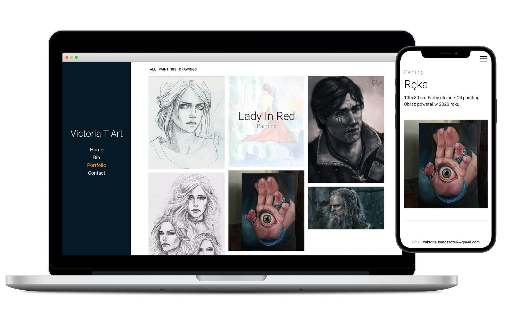

# Victoria T Art - In Progress

Victoria T Art is a portfolio/blog website built on Next.js. Plan behind the project was simple, to make an easly managable application for non programmer. Owner wants to be able to upload her arts to present skills and possibly make a connections with new customers.

## Goal of the project:

Create responsive, easy to follow, blog/portfolio. Content should be dynamic and easy to change for website owner who is not familiar with code.

## Lessons Learned:

- How to use SSR tech
- SEO importance
- Creating 100% dynamic content

## Stack

- React
- NextJS
- Strapi

### Live
https://victoria-t-art.com/

