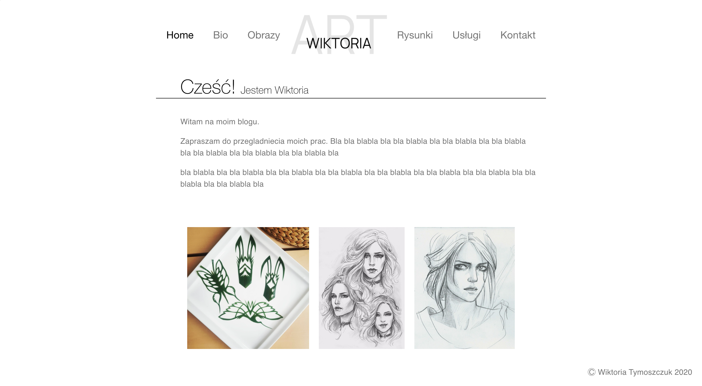

# Home Budget App - In Progress

Blog website for Wiktoria T.

### To run app

- Clone repositry,
- Go into directory `cd wika-blog-next`
- Run `npm install`
- Run `npm run dev`

Your app will be available at http://localhost:3000/

## Goal of the project:

Create responsive, easy to follow, blog/portfolio. Content should be dynamic and easy to change for website owner who is not familiar with code.

## Lessons Learned:

- How to use SSR tech
- SEO importance
- Creating 100% dynamic content

## Stack

- HTML
- CSS
- JS
- React
- NextJS

### Live

Not yet available.

### todo

Paintings, Drawings

- picture big size and rest small.
- clickable
- pagination
- Style detailed page
- navigation to another paintings/drawings on detailed view
- thumbnail pic hover, title
- contact connect mail and style,
- FAQ
